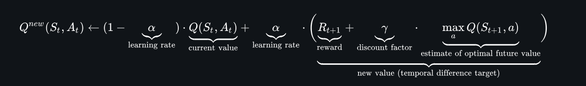

# Using Reinforced Learning for Blackjack

## What is blackjack?
Blackjack a popular and simple casino game where the objective is keep taking cards until the sum of their values is lower or equal to 21. In the scenario of going over that threshold the player goes bust and loses the game. In order to avoid the scenario where the player wins by always not taking cards, he has to go against the dealer, which will start taking cards until he reaches (or not) the value 17. If the dealer goes bust then the player is declared the winner.
## Modeling the enviroment
As it was mentioned previously, the game is simple due to it's discrete nature. Thus the following could be modelled:
### Agent state
- player's card sum (3,4 ...31)
- dealer's card sum (3,4 ... 27)
- usable ace (0 or 1)
### Action space
- hit/stick (0 or 1)
## Used algorithm
The used algorithm shall be Q learning which is a good choice because the environment is discrete and no probabilities are needed to be computed for the cards.
The Q learning algorithm uses a table in the form _state(i)_:{_action(i):reward(i)_,_action(i+1):reward(i+1)_ ...} which dictates the behaviour of the agent. In our case _state(i)_ signifies the player's and dealer's card sums and whether the former has an usable ace or not, while the actions are to hit or stick. An example shall be seen below:
```
State: Player= 5, Dealer=6, UsableAce=0 -> Stand=-0.143, Hit=-0.023
State: Player= 5, Dealer=7, UsableAce=0 -> Stand=-0.328, Hit=-0.120
```
This Q table is the same across all episodes and is updated continously via Bellman's equation:

### Learning parameters
As it can be seen above the learning process has the following parameters:
- learning rate: takes real values from 0 to 1 and models how much shall the agent take into account the new observations versus the old ones. For a rate of 0 the agent will always use the old observations while for the value of 1 it will discard those.
- discount factor: specifies how relevant are the rewards from future observations. The lower the value, the less irelevant are the future actions when updating the table.
## Results
After having done running all of the episodes the final Q table will be obtained, which for this application shall be seen in `qtable.txt` file.